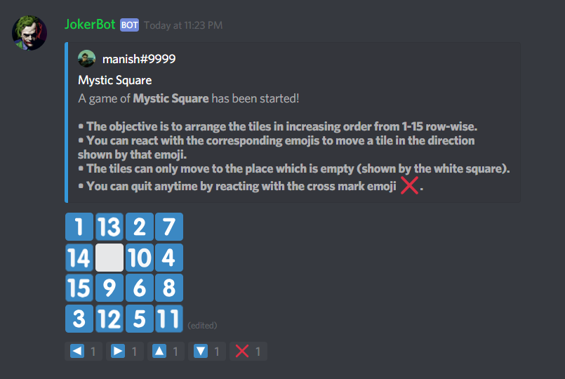
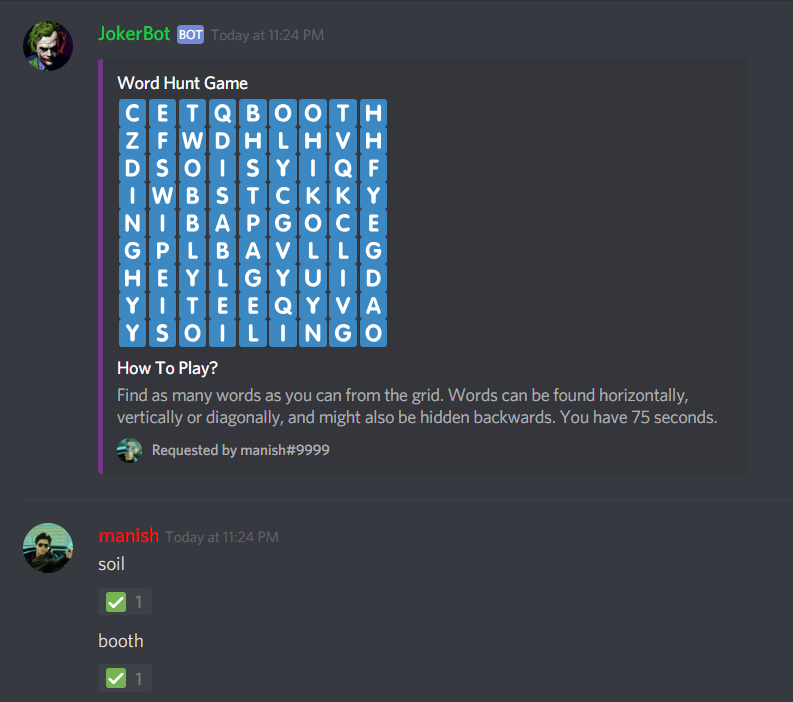
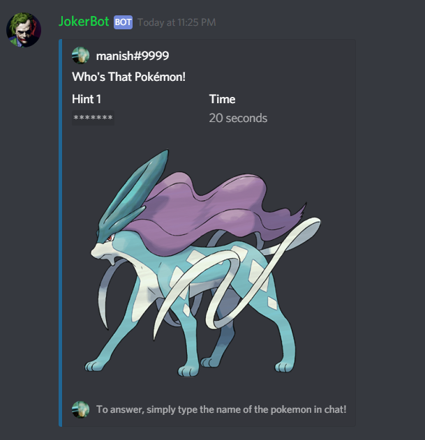

## JokerBot
[](https://discord.gg/2ksxEug)  [](http://hits.dwyl.io/iammanish17/JokerBot)
</br></br>
A Discord entertainment bot with lots of cool and fun games to kill your time. Created for the Discord Hack Week 2019, by manish#9999.

## How to setup?
1) Create a Discord Bot and get it's token. You can check out the tutorial [here](https://github.com/reactiflux/discord-irc/wiki/Creating-a-discord-bot-&-getting-a-token) to know how.
2) Add your token in the config.json in the 'token' key.
3) Upload 11.png (in the emojis folder) as an emoji in your server, and add the ID of that emoji in the '11' key. Follow the same process for 12, 13, 14 and 15 respectively, and your config file is ready now.
4) Install all the required libraries using:
```pip install -r requirements.txt```
5) Run the `bot.py` file and your bot will start running.

## Commands
The command prefix is `j!`, or mentioning the bot also works. The `help` command can be used to view the list of commands.

Command | Description
------- | -----------
`passthebomb` | Come up with a word quickly, or the bomb will explode on you!
`mysticsquare` | Move the tiles in the puzzle and order them from 1-15 to win.
`wordhunt` | Find as many words from the grid as you can!
`extremehunt` | Find the longest word from the grid to win!
`hilo` | Score 12 points and win by guessing if the next card is high/low.
`whosthatpokemon` | Guess the pokemon from the image!
`blackjack` | Beat the dealer without exceeding 21!
`guessthemovie` | Guess the movie from the emojis!
`scramble` | Unscramble the word to win!
`caption` | Captions any image provided!

## Screenshots





## Useful Links
[Add the bot to your server!](https://discordapp.com/oauth2/authorize?client_id=592938355818233856&scope=bot&permissions=8)
[Join the support server!](https://discord.gg/2ksxEug)
